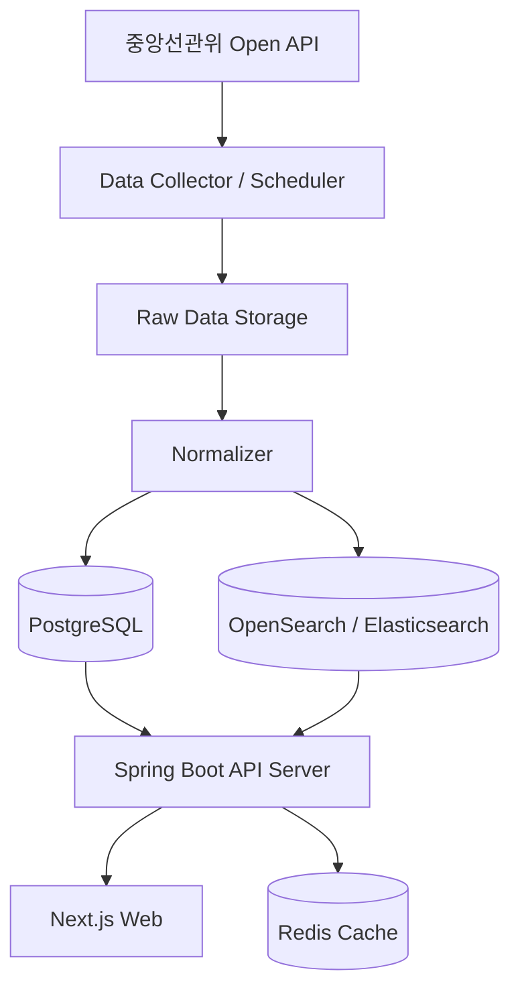

# BeforeYouVote — 투표전5분

투표장 가기 전 5분, 내가 투표할 후보와 공약을 빠르게 확인하는 웹 서비스입니다.

이 프로젝트는 2026년 6월 3일 실시 예정인 대한민국 제9회 전국동시지방선거를 대비해, 유권자가 자신의 지역 후보자 정보를 쉽고 빠르게 확인할 수 있도록 돕는 것을 목표로 합니다.

서비스는 특정 후보를 추천하거나 평가하지 않습니다. 중앙선거관리위원회 등 공식 출처에서 제공하는 정보를 보기 좋게 정리하고, 후보자 간 동일한 기준의 비교 화면을 제공하는 데 집중합니다.

> 임시 서비스명: 우리동네후보

## 문제 정의

지방선거는 선거 종류와 후보자가 많고, 유권자가 실제로 확인해야 하는 정보가 지역별로 다릅니다. 시도, 시군구, 읍면동 또는 선거구에 따라 투표해야 하는 선거 종류가 달라지고, 후보자 정보도 여러 화면과 문서에 흩어져 있어 짧은 시간 안에 파악하기 어렵습니다.

BeforeYouVote는 사용자가 자신의 지역을 선택하면 해당 지역에서 확인해야 할 선거 종류와 후보자 정보를 한 번에 확인할 수 있게 합니다.

## 서비스 원칙

이 서비스는 정치적 의견이나 추천을 제공하지 않습니다.

- 공식 출처 기반 데이터만 사용합니다.
- 후보자별 동일한 항목과 동일한 UI 구조를 제공합니다.
- 특정 후보를 추천하거나 점수화하지 않습니다.
- 후보자 순서는 기호순, 이름순, 정당순 등 객관적 기준만 사용합니다.
- AI 요약 기능을 추가하더라도 원문을 함께 제공합니다.
- AI 요약은 참고용임을 명확히 표시합니다.
- 모든 데이터에는 출처와 수집 시각을 저장합니다.
- 후보자 정보 변경 가능성을 고려해 원본 데이터도 함께 저장합니다.

## 핵심 사용자 시나리오

### 1. 내 지역 후보 찾기

사용자는 자신의 지역을 선택합니다.

예시:

- 서울특별시 마포구 서교동
- 경기도 남양주시 다산동
- 부산광역시 해운대구 우동

서비스는 사용자가 선택한 지역에서 확인해야 할 선거 종류를 보여줍니다.

예시:

- 시도지사
- 구시군의 장
- 시도의회의원
- 구시군의회의원
- 교육감
- 비례대표 지방의원

사용자는 선거 종류를 선택하고 해당 선거의 후보자 목록을 확인합니다.

### 2. 후보자 상세 정보 확인

사용자는 후보자 카드를 클릭해 상세 정보를 확인합니다.

후보자 상세 화면에는 다음 정보가 포함됩니다.

- 후보자 이름
- 정당명
- 기호
- 출마 선거 종류
- 선거구
- 나이
- 성별
- 직업
- 학력
- 경력
- 재산
- 병역
- 납세
- 전과
- 후보자 등록 상태
- 공식 출처
- 데이터 수집 시각

### 3. 후보자 비교

사용자는 동일 선거구의 후보자 2명 이상을 선택해 비교할 수 있습니다.

비교 화면은 평가가 아닌 정보 나열에 집중하며, 표 형태로 제공합니다.

비교 항목 예시:

- 정당
- 나이
- 직업
- 학력
- 주요 경력
- 재산
- 병역
- 납세
- 전과
- 공약 키워드

### 4. 공약 확인

후보자가 공약 정보를 제공한 경우, 사용자는 후보자별 공약을 확인할 수 있습니다.

공약 화면에는 다음 정보가 포함됩니다.

- 공약 제목
- 공약 원문
- 공약 분야
- 공식 출처

공약 요약 기능은 후순위 기능으로 분리합니다. 초기 MVP에서는 공약 원문 제공을 우선합니다.

## MVP 범위

초기 MVP는 과하게 만들지 않고, 유권자가 지역 후보자를 빠르게 확인하는 흐름에 집중합니다.

### 포함

- 지역 선택
- 선거 종류 선택
- 후보자 목록 조회
- 후보자 상세 조회
- 후보자 비교
- 공식 출처 표시
- 데이터 수집 시각 표시
- 원본 데이터 저장

### 제외 또는 후순위

- 공약 AI 요약
- 공약 자동 분류
- 관심 후보 저장
- 알림 기능
- 개인화 추천
- 후보자 점수화
- 고도화 검색 엔진

## 제품 설계 피드백

현재 아이디어의 방향은 좋습니다. 특히 "추천하지 않고, 공식 정보를 같은 구조로 보여준다"는 원칙이 서비스의 신뢰성을 만드는 핵심입니다. 다만 구현 단계에서는 다음 지점을 초기에 명확히 잡는 것이 좋습니다.

### 1. 추천 서비스가 아니라 확인 서비스로 포지셔닝

정치 서비스는 작은 UI 문구나 정렬 방식만으로도 편향처럼 보일 수 있습니다. 따라서 "좋은 후보 찾기"보다 "내 투표지에 나올 후보 확인"에 가까운 표현을 쓰는 것이 안전합니다.

권장 표현:

- 내 지역 후보 확인
- 후보자 정보 비교
- 공식 자료 기반 후보 정보
- 투표 전 확인할 정보

피해야 할 표현:

- 후보 추천
- 좋은 후보
- 유리한 후보
- 검증된 후보
- 점수, 랭킹, 등급

### 2. 데이터 출처와 수집 시각을 UI의 일부로 취급

출처와 수집 시각은 부가 정보가 아니라 이 서비스의 신뢰를 지탱하는 핵심 기능입니다. 후보자 상세, 비교, 공약 화면 모두에서 출처와 수집 시각을 노출해야 합니다.

데이터가 변경될 수 있으므로 정규화된 데이터와 함께 원본 응답을 저장하는 구조가 필요합니다.

### 3. 지역 선택 모델을 먼저 검증

지방선거는 행정구역, 선거구, 읍면동, 비례대표 단위가 섞입니다. MVP에서 가장 큰 리스크는 화면 구현보다 "사용자가 선택한 지역에서 어떤 선거를 봐야 하는가"를 정확히 매핑하는 것입니다.

초기에는 전국 전체를 목표로 하기보다, 한두 개 시도를 샘플로 삼아 지역-선거구 매핑과 후보 조회 흐름을 먼저 검증하는 것이 좋습니다.

### 4. 공약은 원문 우선, 요약은 나중

AI 요약은 유용하지만 정치 정보에서는 오해와 누락의 위험이 큽니다. MVP에서는 공약 원문, 출처, 수집 시각을 안정적으로 제공하는 것이 우선입니다.

요약을 추가할 경우에는 다음 조건이 필요합니다.

- 원문을 항상 함께 표시
- 요약이 참고용임을 명확히 표시
- 요약 생성 시각 저장
- 사용한 모델 및 프롬프트 버전 저장
- 후보자별 동일한 요약 기준 적용

## 주요 화면

### 메인 페이지

- 서비스 목적을 짧게 설명합니다.
- 지역 선택으로 바로 진입할 수 있게 합니다.
- 추천이나 평가가 아닌 공식 정보 확인 서비스임을 명확히 보여줍니다.

### 지역 선택 페이지

- 시도, 시군구, 읍면동 또는 선거구를 선택합니다.
- 선택한 지역 기준으로 확인 가능한 선거 종류를 보여줍니다.

### 후보자 목록 페이지

- 선택한 지역과 선거 종류에 해당하는 후보자 목록을 카드 형태로 보여줍니다.
- 후보자 이름, 정당, 기호, 선거구, 주요 기본 정보를 표시합니다.
- 동일 선거구 후보자를 비교 대상으로 선택할 수 있습니다.

### 후보자 상세 페이지

- 후보자의 기본 정보와 등록 정보를 항목별로 보여줍니다.
- 재산, 병역, 납세, 전과 등 민감한 정보는 공식 자료 기반으로 중립적으로 표시합니다.
- 출처와 수집 시각을 함께 표시합니다.

### 후보자 비교 페이지

- 동일 선거구의 후보자를 표 형태로 비교합니다.
- 모든 후보자에게 동일한 항목과 동일한 표시 순서를 적용합니다.
- 비교 결과에 점수나 평가 문구를 붙이지 않습니다.

## 기술 스택

### Frontend

- Next.js
- React
- TypeScript
- Tailwind CSS

### Local Development

현재 구현된 첫 번째 MVP 슬라이스는 Next.js 모바일 웹입니다.

요구 런타임:

- Node.js 20.9 이상
- 권장: `.nvmrc`의 Node.js 22.22.0

명령:

```bash
npm install
npm test
npm run build
npm run dev
```

로컬 개발 서버:

```text
http://localhost:3000
```

Next.js는 SEO, 공유 가능한 후보자 상세 페이지, 정적/서버 렌더링 조합을 고려해 사용합니다.

### Backend

- Java 17
- Spring Boot
- Spring Web
- Spring Data JPA
- Spring Scheduler 또는 Spring Batch

백엔드는 후보자 데이터 조회 API와 공식 데이터 수집 로직을 담당합니다.

### Database

- PostgreSQL

후보자, 선거, 선거구, 지역, 공약, 원본 데이터를 저장합니다.

### Cache

- Redis

자주 조회되는 후보자 목록, 지역별 후보자 정보, 선거 종류 목록 등을 캐싱합니다. 초기 MVP에서는 선택적으로 적용합니다.

### Search

- 초기: PostgreSQL 기반 검색
- 이후: Elasticsearch 또는 OpenSearch

후보자 이름, 지역, 정당, 선거구 검색을 고도화할 때 검색 엔진을 추가합니다.

### Infra

초기 개발 환경은 Docker Compose를 사용합니다.

구성 요소:

- frontend
- backend
- postgresql
- redis
- opensearch 또는 elasticsearch

## 전체 아키텍처



## 데이터 설계 초안

### Election

선거 자체를 나타냅니다.

- id
- name
- election_date
- election_type
- source

### Region

행정구역 또는 사용자 선택 지역을 나타냅니다.

- id
- sido
- sigungu
- eupmyeondong
- legal_dong_code
- administrative_dong_code

### Constituency

선거구를 나타냅니다.

- id
- election_id
- name
- type
- sido
- sigungu
- source_code

### Candidate

후보자 정규화 정보를 나타냅니다.

- id
- election_id
- constituency_id
- name
- party_name
- candidate_number
- age
- gender
- job
- education
- career
- assets
- military_service
- tax_payment
- criminal_record
- registration_status
- source_url
- collected_at
- raw_data_id

### Pledge

후보자 공약 정보를 나타냅니다.

- id
- candidate_id
- title
- category
- content
- source_url
- collected_at
- raw_data_id

### RawData

공식 출처에서 수집한 원본 데이터를 보관합니다.

- id
- source
- source_url
- payload
- collected_at
- checksum

## API 설계 초안

### 지역

```http
GET /api/regions
GET /api/regions/search?keyword=마포구
```

### 선거 종류

```http
GET /api/regions/{regionId}/elections
```

### 후보자

```http
GET /api/elections/{electionId}/constituencies/{constituencyId}/candidates
GET /api/candidates/{candidateId}
```

### 후보자 비교

```http
GET /api/candidates/compare?ids=1,2,3
```

### 공약

```http
GET /api/candidates/{candidateId}/pledges
```

## 구현 우선순위

1. 공식 API와 데이터 구조 확인
2. 샘플 지역 1곳 기준 데이터 수집 파이프라인 구현
3. 원본 데이터 저장 및 정규화 테이블 설계
4. 후보자 목록 API 구현
5. 후보자 상세 API 구현
6. 지역 선택 및 선거 종류 선택 UI 구현
7. 후보자 목록, 상세, 비교 UI 구현
8. 출처와 수집 시각 표시
9. 샘플 지역 확대
10. 캐시와 검색 고도화 검토

## 개발 환경 목표

초기 개발 환경은 다음 구성을 목표로 합니다.

```text
before-you-vote/
  apps/
    web/        # Next.js frontend
    api/        # Spring Boot backend
  infra/
    docker-compose.yml
  docs/
    data-sources.md
    api-design.md
```

## 주의할 점

- 공식 데이터의 필드명과 응답 구조가 바뀔 수 있으므로 수집 계층과 서비스 계층을 분리합니다.
- 후보자 정보는 민감할 수 있으므로 원문 출처, 수집 시각, 원본 데이터를 함께 보관합니다.
- 비교 UI는 정보의 배치를 동일하게 유지하고, 강조 색상이나 문구로 특정 후보가 유리해 보이지 않도록 합니다.
- MVP에서는 Redis와 OpenSearch를 필수 구성으로 두지 않고, PostgreSQL만으로 먼저 동작하는 구조를 권장합니다.
- 전국 단위 전체 구현 전에 샘플 지역으로 데이터 흐름을 검증합니다.
