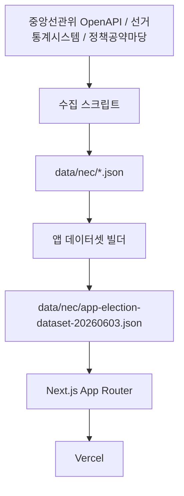

# BeforeYouVote - 투표전5분

투표 전 내 지역에서 확인해야 할 선거와 후보자 정보를 공식 자료 기준으로 빠르게 확인하는 모바일 웹 서비스입니다.

서비스 주소: https://before-you-vote.vercel.app

이 프로젝트는 2026년 6월 3일 실시 예정인 대한민국 제9회 전국동시지방선거를 대비해 만들었습니다. 특정 후보를 추천하거나 평가하지 않고, 중앙선거관리위원회 등 공식 출처의 정보를 같은 구조로 정리해 보여주는 데 집중합니다.

## 서비스 원칙

- 공식 출처 기반 데이터만 사용합니다.
- 특정 후보를 추천, 점수화, 랭킹화하지 않습니다.
- 후보자 순서는 기호, 정렬순서, 이름 등 객관적 기준만 사용합니다.
- 후보자 비교표는 모든 후보에게 동일한 항목과 표시 순서를 적용합니다.
- 출처와 수집일을 UI에 표시합니다.
- 사용자의 위치 좌표는 지역 추정에만 사용하고 서버에 저장하지 않습니다.
- 회원가입 없이 이용하며, 선택한 지역과 선거 항목은 사용자 브라우저의 cookie/localStorage에 저장합니다.

## 현재 구현 범위

- 지역 직접 선택
- 광역/시군구/구 단위 하위 지역 선택 요구
- 읍면동 선택 기반 지방의원 선거구 필터링
- 브라우저 위치 권한 기반 지역 추정
  - Naver Maps Reverse Geocoding 우선
  - Kakao Local API reverse geocoding fallback
  - 일부 지역 bounding box fallback
- 확인할 선거 목록 표시
- 선택한 선거의 후보자 상세 카드 표시
- 후보자 공보, 5대공약 PDF, 공개자료 링크 표시
- 카카오톡 인앱브라우저 PDF 다운로드를 위한 프록시 API
- 후보 비교표
  - 왼쪽 항목 열 고정
  - 후보명 헤더 상단 고정
  - 후보명 헤더와 본문 가로 스크롤 동기화
- 개인정보처리방침 페이지
- Open Graph/Twitter 공유 이미지
- Vercel Analytics

## 기술 스택

- Next.js 16 App Router
- React 19
- TypeScript
- Tailwind CSS
- Vitest
- ESLint
- Vercel

## 런타임 구조

앱은 별도 데이터베이스 없이 빌드/실행 시 JSON 데이터셋을 읽습니다.



주요 런타임 파일:

- `src/app/page.tsx`: cookie에서 초기 선택값을 읽고 대시보드 렌더링
- `src/components/election-dashboard.tsx`: 지역 선택, 선거 목록, 후보 카드, 비교표 UI
- `src/components/location-assist.tsx`: 브라우저 위치 권한 요청과 지역 추정
- `src/app/api/reverse-geocode/route.ts`: 좌표를 행정동 정보로 변환하는 API route
- `src/domain/reverse-geocode-providers.ts`: Naver/Kakao 역지오코딩 provider와 응답 정규화
- `src/domain/reverse-geocode.ts`: 역지오코딩 결과를 앱 지역/읍면동 선택값으로 변환
- `src/domain/geolocation.ts`: provider 실패 시 사용하는 일부 지역 좌표 fallback
- `src/app/api/document-download/route.ts`: 선관위 PDF 다운로드 프록시
- `src/app/privacy/page.tsx`: 개인정보처리방침
- `src/domain/election.ts`: 지역/선거/후보 조회와 비교표 데이터 생성
- `src/domain/district-mapping.ts`: 읍면동별 선거구 필터링
- `src/domain/generated-election-data.ts`: 앱 데이터셋 JSON 로더
- `src/domain/generated-district-mappings.ts`: 읍면동-선거구 매핑 JSON 로더

## 위치 기반 지역 찾기

브라우저에서 좌표 권한을 받으면 `/api/reverse-geocode`가 좌표를 행정동으로 변환합니다.

처리 순서:

1. `NAVER_MAPS_CLIENT_ID`와 `NAVER_MAPS_CLIENT_SECRET`이 있으면 Naver Maps Reverse Geocoding API를 먼저 호출합니다.
2. Naver 호출이 실패하고 `KAKAO_REST_API_KEY`가 있으면 Kakao Local API를 fallback으로 호출합니다.
3. 서버 역지오코딩이 매핑되지 않으면 클라이언트의 일부 지역 bounding box fallback을 시도합니다.
4. 행정동 결과는 앱 데이터셋의 지역/읍면동 옵션으로 해석됩니다.

운영 중인 Naver endpoint:

```text
https://maps.apigw.ntruss.com/map-reversegeocode/v2/gc
```

## 데이터 파일

현재 앱은 `data/nec` 아래의 JSON 파일을 기준으로 동작합니다.

- `app-election-dataset-20260603.json`: 앱에서 직접 읽는 지역/선거/후보 통합 데이터셋
- `district-mappings-20260603.json`: 읍면동별 시도의원/구시군의원 선거구 매핑
- `nationwide-candidates-20260603.json`: 전국 후보자 기본 정보
- `nationwide-candidate-details-20260603.json`: 후보자 상세 공개 정보
- `candidate-documents-20260603.json`: 선거공보/5대공약 PDF 메타데이터
- `candidate-pledges-20260603.json`: 5대공약 텍스트 원문
- `nationwide-summary-20260603.json`: 전국 수집 요약
- `db-export-20260603.json`: 과거 DB 스냅샷 보존용 데이터. 앱 실행에는 사용하지 않습니다.

## 현재 데이터 범위

2026년 5월 26일 기준 생성된 JSON 데이터셋의 범위입니다.

- 직접 선택 가능 지역: 312개
- 지역별 선거 항목: 3,209개
- 앱 표시 후보 항목: 17,904개
- 후보자 상세 공개정보 수집 후보: 7,829명
- 정책공약마당 문서 매칭 후보: 6,271명
- 앱 표시 후보 중 선거공보 PDF 링크: 7,547개
- 앱 표시 후보 중 5대공약 PDF 링크: 2,691개
- 5대공약 텍스트 원문 수집 후보: 617명
- 5대공약 원문 항목: 3,085개
- 앱 표시 후보 중 공약 항목: 13,455개
- 읍면동-선거구 매핑 지역: 243개
- 읍면동-선거구 매핑 실패: 0개

## 수집 출처

- 중앙선거관리위원회 후보자 OpenAPI
- 중앙선거관리위원회 선거통계시스템 후보자 상세 페이지
- 중앙선거관리위원회 정책공약마당 후보자공약 JSON
- 시·도선거관리위원회 구·시·군위원회 선거관리현황 페이지

## 환경 변수

로컬 개발은 `.env` 파일을 사용합니다. 운영 배포는 Vercel Project Settings의 Environment Variables에 같은 이름으로 등록합니다.

```bash
DATA_OPEN_API_KEY=
KAKAO_REST_API_KEY=
NAVER_MAPS_CLIENT_ID=
NAVER_MAPS_CLIENT_SECRET=
```

용도:

- `NAVER_MAPS_CLIENT_ID`: Naver Maps Reverse Geocoding API Client ID
- `NAVER_MAPS_CLIENT_SECRET`: Naver Maps Reverse Geocoding API Client Secret
- `KAKAO_REST_API_KEY`: Naver 실패 시 fallback으로 사용할 Kakao Local API REST API key
- `DATA_OPEN_API_KEY`: 중앙선관위 데이터 수집 스크립트 실행에 필요. 운영 앱 런타임에는 필요하지 않습니다.

`NAVER_MAPS_CLIENT_ID`와 `NAVER_MAPS_CLIENT_SECRET`은 서버 전용 값입니다. `NEXT_PUBLIC_` prefix를 붙이지 않습니다.

## 데이터 수집 명령

수집 및 생성 스크립트:

```bash
npm run collect:data
npm run collect:nationwide
npm run collect:details
npm run collect:documents
npm run collect:pledges
npm run collect:districts
npm run build:app-data
```

스크립트 역할:

- `collect:data`: 서울 마포구와 경기 화성시동탄구 샘플 검증용 수집
- `collect:nationwide`: 전국 후보자 기본 정보 수집
- `collect:details`: 선거통계시스템 후보자 상세 공개 정보 수집
- `collect:documents`: 정책공약마당 선거공보/5대공약 PDF 메타데이터 수집
- `collect:pledges`: 5대공약 텍스트 원문 수집
- `collect:districts`: 읍면동-선거구 매핑 수집
- `build:app-data`: 수집 데이터를 앱 표시용 JSON 데이터셋으로 변환

## 로컬 개발

요구 런타임:

- Node.js 20.9 이상
- npm 10 이상

설치:

```bash
npm install
```

개발 서버:

```bash
npm run dev
```

로컬 주소:

```text
http://localhost:3000
```

검증:

```bash
npm run lint
npm test
npm run build
```

## 배포

Vercel 프로젝트에 연결되어 있으며 운영 URL은 다음과 같습니다.

```text
https://before-you-vote.vercel.app
```

프로덕션 배포:

```bash
npx -y vercel --prod
```

배포 후 위치 API 확인 예시:

```bash
curl -s "https://before-you-vote.vercel.app/api/reverse-geocode?latitude=37.5559&longitude=126.9238"
```

정상 응답 예시:

```json
{
  "status": "mapped",
  "addressName": "서울특별시 마포구 서교동",
  "sido": "서울특별시",
  "sigungu": "마포구",
  "eupmyeondong": "서교동"
}
```

## 주의 사항

- 실제 투표 가능 선거는 주민등록상 주소와 투표안내문 기준으로 확인해야 합니다.
- 위치 기반 지역 찾기는 브라우저 위치 권한과 외부 역지오코딩 API 결과에 의존하므로 실제 투표구와 다를 수 있습니다.
- 읍면동-선거구 매핑이 있는 지역은 읍면동 선택 전까지 선거 목록을 표시하지 않습니다.
- 공식 출처 데이터가 변경되면 JSON 데이터셋을 다시 수집/생성해야 합니다.
- 정치 정보 특성상 UI 문구, 정렬, 색상 강조가 특정 후보에게 유리해 보이지 않도록 유지해야 합니다.
